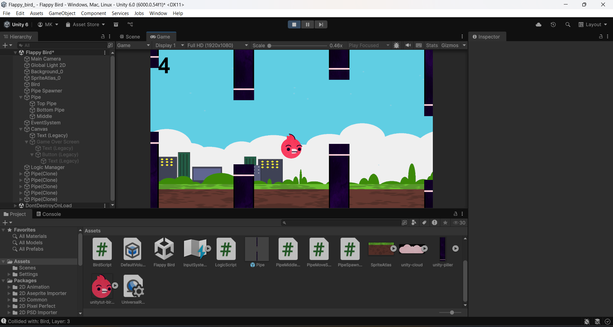

🐦 Flappy Bird (Unity Project)
A modern recreation of the classic arcade mobile game, Flappy Bird, built using the Unity game engine. This project demonstrates core game development concepts in Unity, including C# scripting, physics, and UI management.

🚀 Features

Flap-to-Fly Mechanic: The bird's movement is controlled by a single input (Space key), applying an upward force to a Rigidbody2D.

Procedural Pipe Generation: Pipes are spawned at a regular spawnRate of 2 seconds from a Pipe Spawner object. The vertical position of the gap is randomized between a 

minY of -1f and a maxY of 3f.

Dynamic Obstacles: Pipes move continuously from right to left at a fixed moveSpeed of 5 units per second. Once a pipe moves past a certain 

deadZone, it is automatically deleted from the scene.

Scoring System: The player's score is tracked by a LogicScript. A 

PipeMiddleScript on each pipe detects when the bird passes through the gap and increases the score by 1.

Game Over Screen: A Game Over Screen is set to inactive by default. When the bird collides with a pipe, the 

gameOver function is called, activating this screen and ending the game.

Restart Functionality: A "Play Again" button on the game over screen calls the restartGame() method in the LogicScript, which reloads the active scene to start a new game.

🛠️ Technologies Used
Game Engine: Unity

Language: C#

Physics: Unity's built-in 2D physics engine (Rigidbody2D and CircleCollider2D) 

Rendering: Universal Render Pipeline (URP)

🚀 Getting Started
Prerequisites
Unity Hub

Unity Editor (LTS recommended)

Installation

Clone the repository: Bash git clone https://github.com/Manvith-kumar16/Flappy-Bird.git

Open the project in the Unity Editor.
Running the Application
Open the Flappy Bird.unity scene file.
Press the Play button in the Unity Editor to run the game.

🤝 Contributing
Contributions are welcome! If you have a suggestion or find a bug, please feel free to open an issue or submit a pull request.

Fork the project.

Create your feature branch (git checkout -b feature/AmazingFeature).

Commit your changes (git commit -m 'Add some AmazingFeature').

Push to the branch (git push origin feature/AmazingFeature).

Open a pull request.

🙏 Acknowledgments
The original creators of Flappy Bird for the inspiration.
